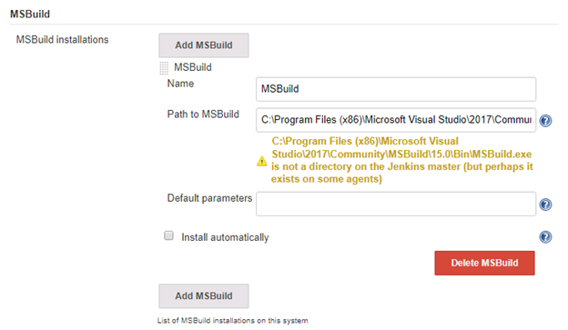

# CSharp Jenkins Pipeline

This example demonstrates the Jenkins pipeline file syntax to process a Microsoft CSharp project. The HelloWorld Microsoft solution file is provided.

## Assumptions: 
The Microsoft Visual Studio 2017 is installed on the Jenkins server.
A SonarQube server is available.

## Plugins to Install

If they are not exist need to install the following Jenkins plugins:
1. MSBuild - This plugin makes it possible to build a Visual Studio project (.proj) and solution files (.sln)
2. MSTest - This plugin converts MSTest TRX test reports into JUnit XML reports so it can be integrated with Hudson's JUnit features.
3. MSTestRunner - This plugin run MSTest command line tool to execute unit tests for .NET project.

### Create Jenkins Global Tool
After the plugins are installed need to configure Jenkins to use them as a tool.
Go to **Jenkins -> Manage Jenkins -> Global Tool Configuration**

### Install NuGet

NuGet is the package manager for **.NET**. The NuGet client tools provide the ability to produce and consume package.

https://www.nuget.org/downloads 

### Configure Jenkins SonarQube MSBuild

## Plugin to Install

**SonarQube Scanner for Jenkins** - This plugin allows an easy integration of SonarQube the open source platform for CI of code quality.

### Configure SonarQube

Go to **Jenkins -> Manage Jenkins -> Configure System** add SonarQube server information.

### Create SonarQube Global Tool

Go to **Jenkins -> Manage Jenkins -> Global Tool Configuration**, to add SnarScanner for MSBuild.

